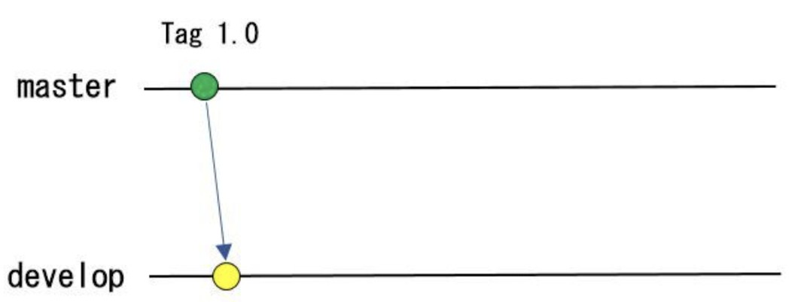
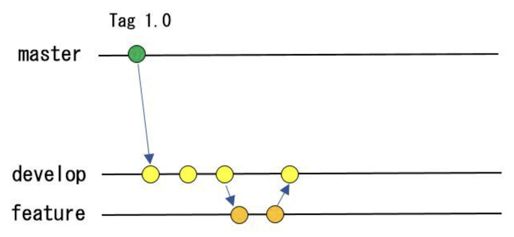

# 基本的なGitコマンド

## 基本的な単語

### レポジトリ
レポジトリはファイルやディレクトリや変更履歴を管理する場所のことを言います。

### ローカルレポジトリ
主に個人が管理して作業しているレポジトリのことをいいます。ディレクトリの中の`.git`ディレクトリがレポジトリの本体です。

### リモートレポジトリ
リモートで管理され主に複数の人で変更されるレポジトリです。`foot.git`や`bar.git`のような名前で管理されます。自分でサーバを立てて管理することもできるが、GitHubやGitLabのようなPaaSサービスで管理されることが多い。

###  コミット
自分の加えた変更を、ローカルレポジトリに登録することをコミットと言います。

### ステージング
ローカルレポジトリの中身はは、`ワークツリー`、`ステージングエリア`、`レポジトリ`で構成されています。ローカルレポジトリに登録する前にワーキングツリーの状態を一度ステージングエリアに登録する必要があります。ワークツリーの内容をステージングエリアに登録するには`git add`コマンドを使って登録します。

### ブランチ
ブランチは変更履歴を分岐する機能です。ディフォルトでは`master`というブランチが設定されています。通常このブランチをそのまま利用せず、開発用は`develop`というようにブランチを切って、そちらで履歴を管理しながら開発を行ったりします。

#### `develop` 開発ブランチ
`master`から開発用に`devlop`ブランチが分岐されます。通常はこちらで開発時の履歴が管理されます。



#### `feature-*` 機能追加ブランチ
`develop`ブランチは複数の開発者で共有されます。そのため履歴が混ざらないように機能を追加する場合は、`feature-*`のように機能追加用のブランチを作成して履歴を管理します。




## 基本的なコマンド

### 初期設定
gitを使い始める時の基本的な初期設定、

#### ユーザ名とメールアドレス
コミットをするためには、Gitにユーザ名とメールアドレスを登録する必要がります。基本的にはglobalに登録しておけば、全レポジトリにこのユーザー名とメールアドレスが適用されコミット時のログにこのユーザー名とメールアドレスが記録されます。
```
$ git config --global user.name "user_firstname user_lastname"
$ git config --global user.email "user_name@domain.om"
```

#### 初期ブランチ名
ローカルレポジトリを作成した時にディフォルトで初期作成されるブランチ名を登録します。
ディフォルトでは`master`が指定されますが、ローカルレポジトリを作成する時にごちゃごちゃ言われるので設定しておいても良いです。
```
$ git config --global init.defaultBranch main
```

### ローカルレポジトリの作成
ここでは、`example_project`がレポジトリでここで作業が行われると想定しています。

```
$ mkdir example_project
$ cd example_project
$ git init
hint: Using 'master' as the name for the initial branch. This default branch name
hint: is subject to change. To configure the initial branch name to use in all
hint: of your new repositories, which will suppress this warning, call:
hint: 
hint:   git config --global init.defaultBranch <name>
hint: 
hint: Names commonly chosen instead of 'master' are 'main', 'trunk' and
hint: 'development'. The just-created branch can be renamed via this command:
hint: 
hint:   git branch -m <name>
Initialized empty Git repository in ~/Git/example_project/.git/
```

### ステータスの確認
ローカルレポジトリの状態を確認します。不要なファイルを登録したり間違ったブランチで作業しないように頻繁にレポジトリの状態を確認しましょう。

```
$ git status
On branch master
nothing to commit, working tree clean
```
何も変更がない状態では、このように現在のブランチ名と、ワーキングツリーに変更がないことが表示されます。

```
$ git status
On branch master
Changes not staged for commit:
  (use "git add <file>..." to update what will be committed)
  (use "git restore <file>..." to discard changes in working directory)
        modified:   README.md

no changes added to commit (use "git add" and/or "git commit -a")
```
ワークツリーに変更がある場合にはこのように変更があるファイルが表示されます。

### ステージング
変更のあるファイルをワーキングツリーからステージングエリアに登録します。

```
$ git add README.md
$ git status
On branch master
Changes to be committed:
  (use "git restore --staged <file>..." to unstage)
        modified:   README.md
```
`git add`コマンドで登録するファイルを指定してステージング環境に登録します。`git status`で確認すると、ステージング環境に登録されステージング環境に登録されてレポジトリの差分が表示されます。

### コミット
ステージングエリアに登録された変更をローカルレポジトリに追加します。

```
$ git commit -m "[M] modified README.md file"
[master f3bdd0e] modified README.md file
 1 file changed, 1 insertion(+)
```
コミットは`git commit`コマンドで行います。コミット時のlogメッセージは`-m`で引数で与えます。何の変更を加えたかわかりやすいメッセージを入れましょう。

### コミットの確認
変更の履歴を確認します。コミット後はきちんと変更が登録されているか意図した変更になっているか必ず確認しましょう。

#### ログの確認
コミットのログを確認します。いっぱい出ると見にくいのでオプションをつけるのもありです。
```
$ git log
commit 6935000f7942a0943171b90ad9f3fce5aa35a675 (HEAD -> master)
Author: kanameg <kaname.g@gmail.com>
Date:   Sun Dec 17 16:23:06 2023 +0900

    [M] modified README.md file
```

一行で表示したり、コミット番号も短く表示できます。
```
$ git log --oneline
6935000 (HEAD -> master) [M] modified README.md file
1992e0c first commit
```

コミットされた日付や変更メッセージが正しいかを確認します。変更が正しくない場合はコミットを取り消したり修正を行います。
**リモートレポジトリに登録後は変更できなくなってしまいます。** ローカルレポジトリの時点で正しい変更が行われているかきちんと確認しましょう。

#### 詳細の確認

```
$ git show 6935000
commit 6935000f7942a0943171b90ad9f3fce5aa35a675 (HEAD -> master)
Author: kanameg <kaname.g@gmail.com>
Date:   Sun Dec 17 16:23:06 2023 +0900

    [M] modified README.md file

diff --git a/README.md b/README.md
index 8339808..67242f0 100644
--- a/README.md
+++ b/README.md
@@ -1 +1,3 @@
 # Git練習用プロジェクト
+
+変更を追加
```
変更の詳細内容を表示して変更内容が正しいか確認します。想定通りの変更が追加されているか確認します。


## ブランチを使った管理
同じレポジトリを共同で編集してると、変更が競合したり他の人の変更により動作の影響を受けたりして、動作確認しながらの変更が困難になります。ブランチを使ってある動作している状態からレポジトリを分岐し、自分の変更が完了した時点で元のブランチにマージすることで、他の人の変更の影響を受けずに自分の変更を加えていくことが可能です。

### ブランチの確認
現在どのブランチで作業しているか? レポジトリのブランチの状態を確認することができます。

```
$ git branch -a
  develop
* master
  remotes/origin/master
```
`*`がついてるブランチが現在作業中のブランチです。また`-a`オプションをつけることにより、リモート上のレポジトリも確認することができます。

### ブランチの作成
`git branch <ブランチ名>`でブランチを作成します。

新しい機能の開発を開始したりする場合にブランチを作成します。
**ブランチを作成する前には必ず現在のブランチが何かを確認しましょう！**
変更を加えた後に、想定しないブランチから分岐していることに気づくと悲しいことになります。

```
$ git branch -a
* develop   <--- 分岐元を確認！
  master
  remotes/origin/develop
  remotes/origin/master
$ git branch feature-0001
$ git branch -a
* develop
  feature-0001  <--- ブランチが作成されていることを確認
  master
  remotes/origin/develop
  remotes/origin/master
```

### ブランチの変更
コマンドでブランチを作成した場合、現在のブランチは作成されたブランチに変更されず作成元のブランチのままです。`git checkout`コマンドでブランチの変更を行います。（違うブランチに変更を加えたら目も当てられないです）

Visual Studio Codeのgit拡張はブランチを作成すると自動的にブランチを変更したりします。常に自分がどのブランチで作業しているか確認しながら変更を加えていきましょう。

```
$ git checkout feature-0001
Switched to branch 'feature-0001'
```
```
$ git branch -a
  develop
* feature-0001   <--- ブランチが切替わっていることを確認
  master
  remotes/origin/develop
  remotes/origin/master
```

#### 追跡ブランチの自動切替
`-b`オプションをつけるとブランチの切り替えも自動で行ってくれます。
通常はこっちで良いかもしれません。
```
$ git branch feature-0001 -b 
Switched to branch 'feature-0001'
```

### ブランチへの変更作業
ブランチでの作業は通常の作業同様に、ワークツリーでの変更、ステージングエリアへの追加、コミットの順番で、ローカルレポジトリで上のブランチを変更していきます。機能の動作確認を行い、機能追加が完了したら元のブランチへの適用を行います。

### ブランチのマージ
機能の追加が完了したら、変更内容を元のブランチにマージを行います。


---


## 基本的な流れ

1. 新しいブランチを作成して作業開始
2. 変更作業をしてコミット
3. 作業ブランチにリモートの最新を取り込む
4. 作業ブランチの整理を行う
5. リモートブランチにプッシュ
6. プルリクエストを送る
7. レビューの実施
8. レビュー内容を反映してコミットを作成
9. 再レビューの実施
10. 再度作業ブランチの整理を行う
11. マージ（マージはPaaSの機能や手動など色々）
12. ローカルのブランチを削除

